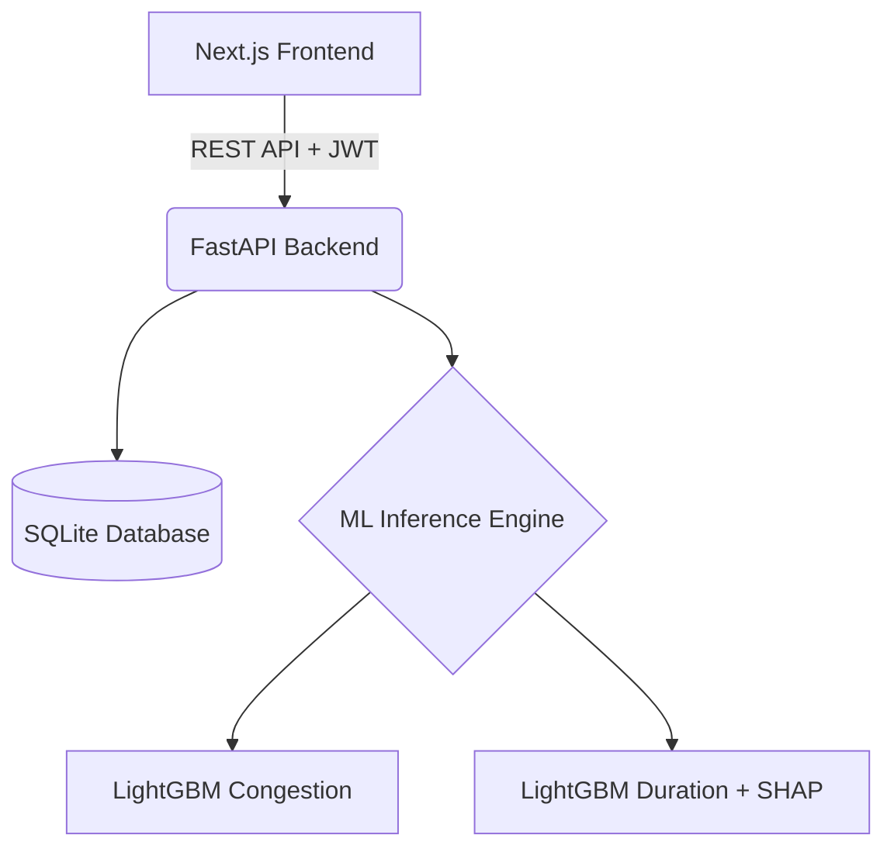

# System Architecture

Acuity-AI utilizes a decoupled, modern web architecture separating a React-based frontend from a Python-based ML/API backend.

## Component Overview

## 1. Frontend (Next.js 16 + React 19)
Located in `frontend/src/`.

- **Client-Side Rendering:** All pages utilize `'use client'` for highly interactive dashboarding.
- **Data Fetching:** SWR (Stale-While-Revalidate) handles aggressive polling (e.g., refreshing Queue Health every 15 seconds) while keeping the UI responsive.
- **Styling:** Tailwind CSS v4 provides a utility-first, highly consistent design system.
- **Routing:** Split logically by user persona:
  - `/patient/*` (Booking, Records, Billing, Messaging, Wait Prediction)
  - `/staff/*` (Command Center, Analytics, Queue Management)
  - `/admin/*` (System Logs)

## 2. Backend API (FastAPI)
Located in `backend/app/`.

- **Routers:** The API is highly modular. Core entities (`appointments.py`, `patients.py`, `billing.py`) are strictly separated from operational analytics (`queue_health.py`, `congestion.py`, `bottleneck.py`).
- **Auth & RBAC:** Handled via JSON Web Tokens (JWT) using the `jose` library. Endpoints are protected by `get_current_user` and `require_role(["patient", "staff", "admin"])` dependency injections.

## 3. Database Layer (SQLAlchemy + SQLite)
Located in `backend/app/models/schema.py`.

A highly normalized relational schema:
- **Core:** `User`, `Patient`, `Doctor`
- **Clinical Flow:** `Appointment`, `Waitlist`, `Consultation`
- **Medical:** `HealthRecord`, `LabResult`, `Prescription`
- **Communication:** `MessageThread`, `Message`, `Notification`
- **Financial/Feedback:** `Invoice`, `Review`

*Note: SQLite is used for portability and out-of-the-box MVP execution. The SQLAlchemy ORM allows seamless migration to PostgreSQL for production environments.*

## 4. ML Services Layer
Located in `backend/app/services/` and `ml/`.

- **Stateless Inference:** Models are loaded into memory globally on application startup (or lazily on first request).
- **Rule-Based Fallbacks:** If ML models (`.txt` files) are missing or fail to load, the services gracefully degrade to sophisticated deterministic heuristics (e.g., computing a mock SHAP breakdown based on basic logic, or mapping the live queue health score to a congestion tier).
- **Subsystems:**
  - `congestion_service.py`: Generates the 30/60/120m forecasts.
  - `queue_health_service.py`: Live SQL aggregations for composite scoring.
  - `simulation.py`: Handles Monte Carlo queue simulations and wait time predictions.
  - `noshowml.py`: Analyzes patient history to score no-show risk.
